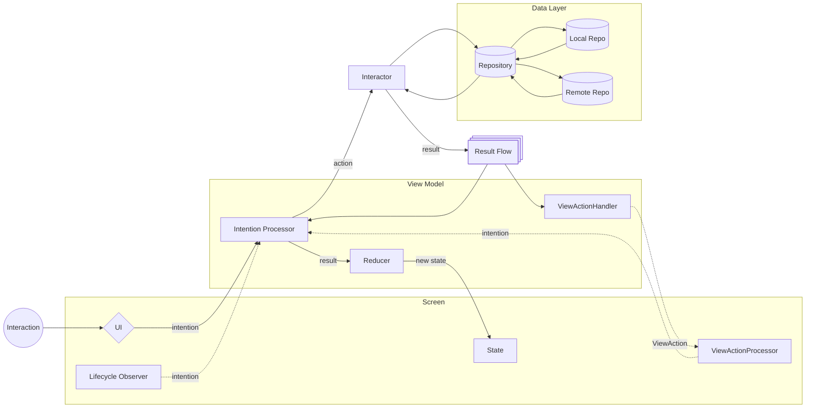

# Architecture

This project uses the **MVI (Model-View-Intent)** architectural pattern.

## MVI Flow

## MVI Components

- **Model**: Represents the state of the application
- **View**: Displays the current state and captures user intents
- **Intent**: Represents user actions and triggers state changes

The MVI pattern ensures unidirectional data flow and predictable state management throughout the application.
