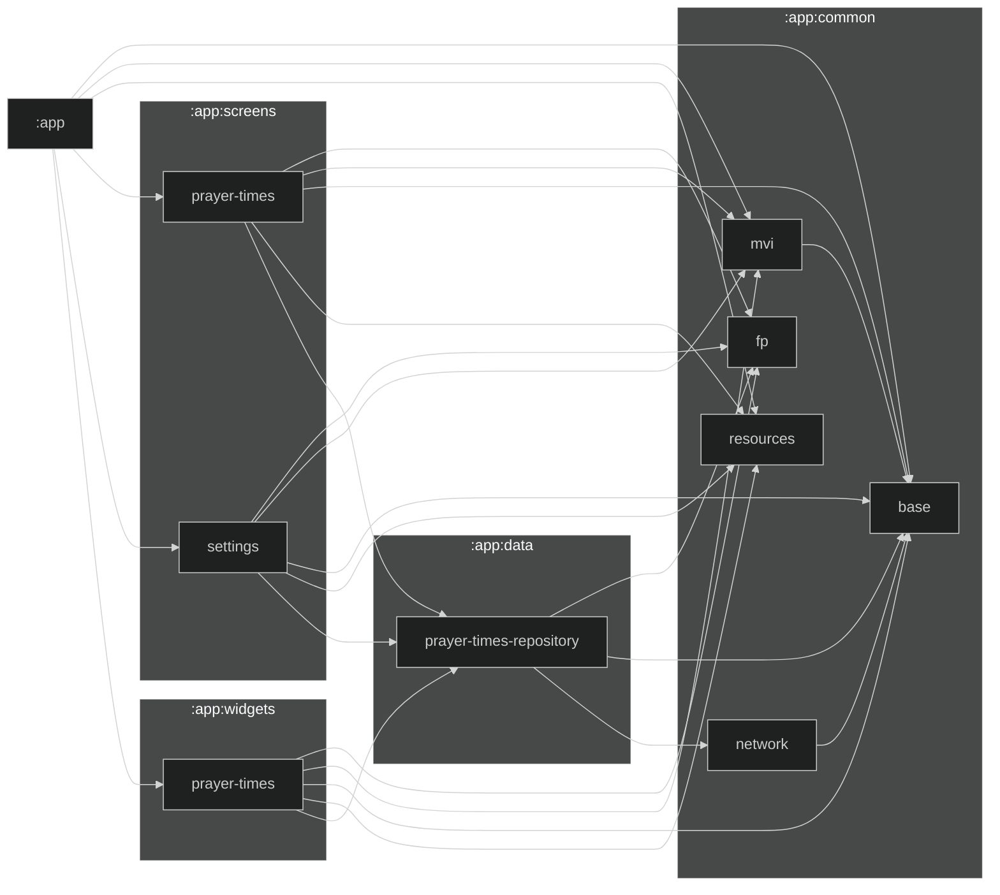

# Ibad 🤖 App

The code behind Ibad's awesome 🤖 App.

## Requirements

The usual stuff:

- Android Studio
- Git

## Architecture

We're using MVI (Model View Intention)

## Module Graph

> Run `./gradlew createModuleGraph` to regenerate the graph
